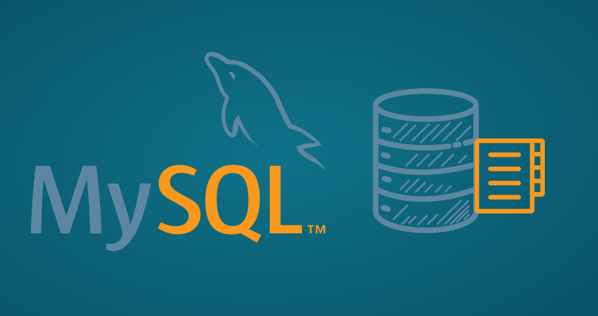

 

## Bienvenido al repositorio del curso de MySql

<!-- 
En este repositorio encontraras todos los documentos utilizados en el curso  Este curso esta basado en documentado confiable en linea  y se hace referencia a todos los recursos  empleados en el mismo. Este curso es detallado y pretende abarcar  la totalidad de conceptos del lenguaje. 

---

Módulos completados 
 
- 01-Tutorial-HTML
	- 001-Introduccion-HTML
	- 002-Editores-HTML
	- 003-HTML-basico
	- 004-Elementos-HTML
	- 005-Atributos-HTML
	- 006-Encabezados-HTML
	- 007-Parrafos-HTML
	- 008-Estilos-HTML
	- 009-Formato-de-texto-HTML
	- 010-Elementos-de-citas- HTML
	- 011-Comentarios-HTML
	- 012-Colores-HTML
	- 013-Estilos-HTML-CSS
	- 014-Enlaces-HTML
	- 015-Imagenes-HTML
	- 016-Tablas-HTML
	- 017-Listas-HTML
	- 018-Elementos-en-Bloque-y-en-línea-HTML
	- 019-HTML-atributo-de-clase
	- 020-HTML-El-atributo-id
	- 021-Iframes-HTML
	- 022-HTML-JavaScript
	- 023-Rutas-de-archivo-HTML
	- 024-HTML-El-elemento-principal
	- 025-Elementos-y-tecnicas-de-diseno-HTML
	- 026-Diseno-web-sensible-HTML

---

Referencias 

MDN Web Docs. (s. f.). Recuperado 8 de mayo de 2020, de https://developer.mozilla.org/es/

W3Schools Online Web Tutorials. (s. f.). Recuperado 8 de mayo de 2020, de https://www.w3schools.com/default.asp -->